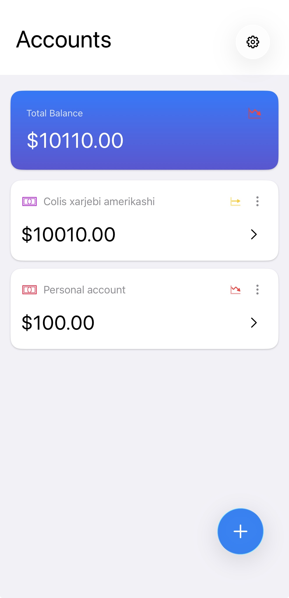
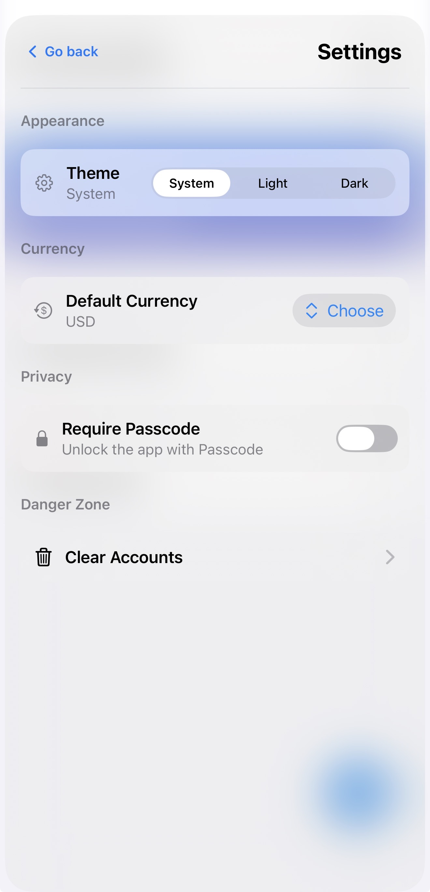
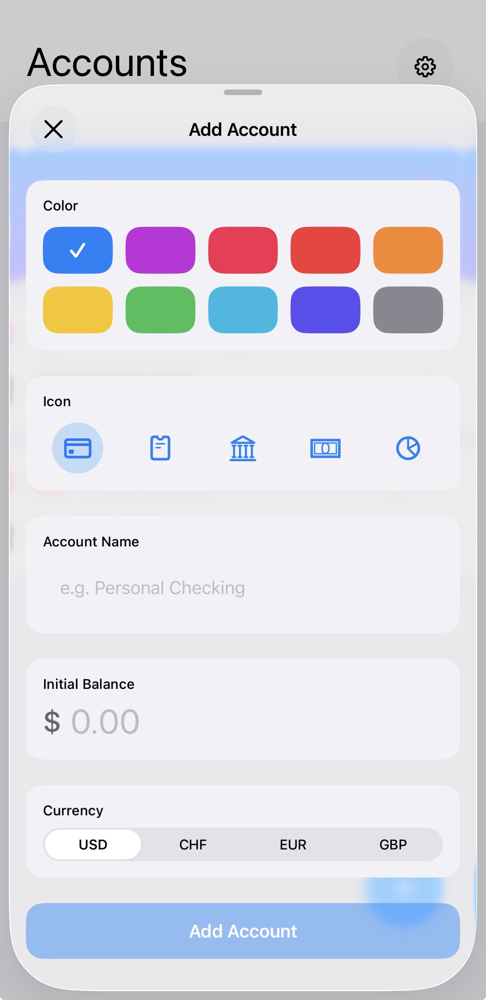
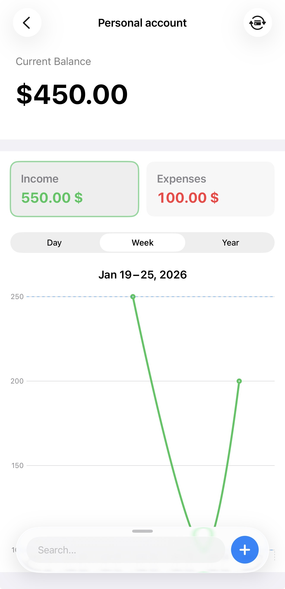
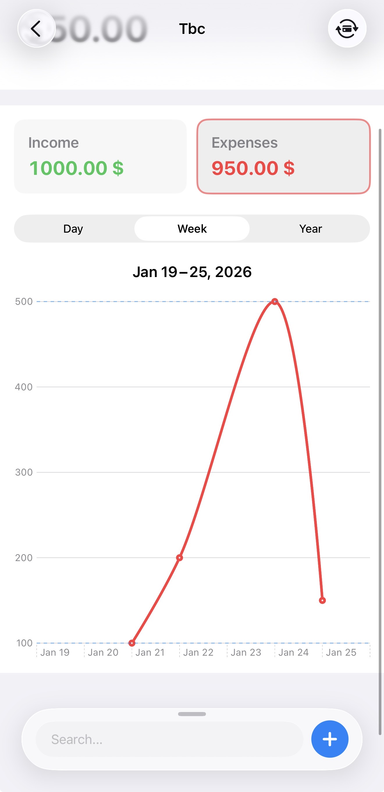
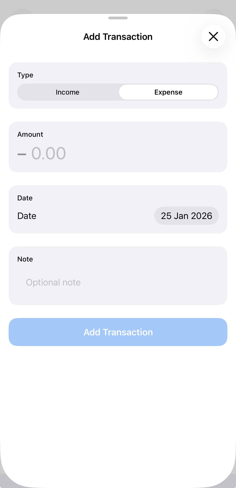
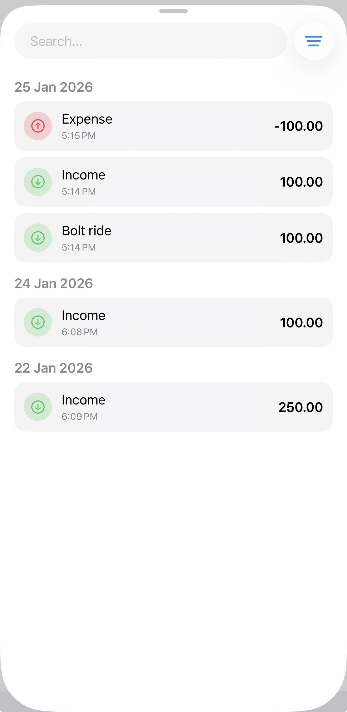
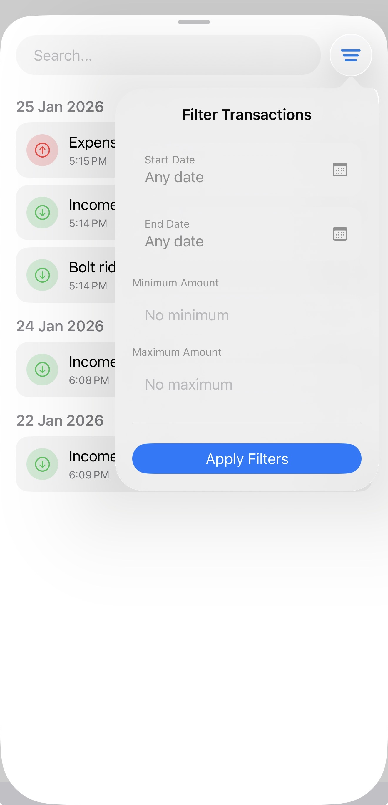
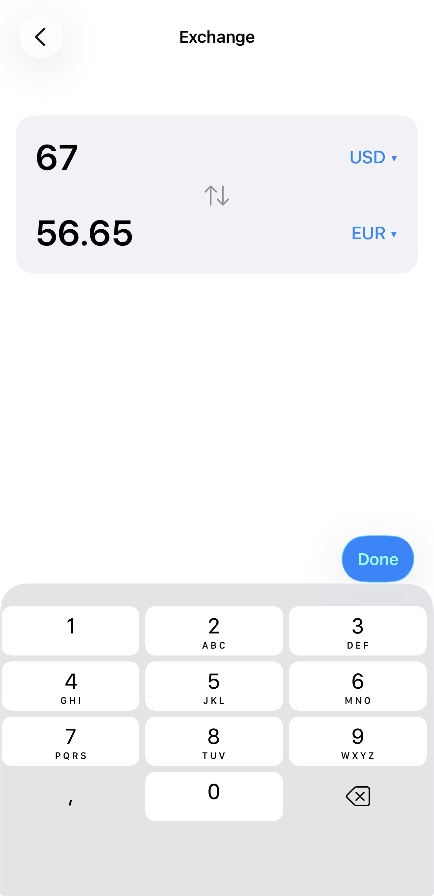
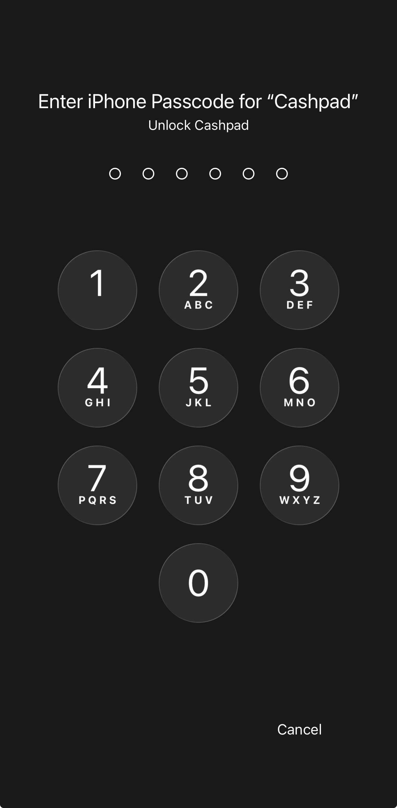

  
  
  
  
  
  

# CashApp

## About 

Cashpad is a modern personal finance app designed to help you understand your money without overwhelming you. Track accounts, monitor income and expenses, and see your financial picture clearly - all in one beautifully crafted experience.  
Built with a clean, minimal interface and smooth animations, Cashpad makes managing money feel natural, fast, and even satisfying.

## Target Audience

- People who earn their own money and want control over it
- Budget-Aware Individuals
- Users building financial discipline early

## Features

- **Account Management** - Create and manage multiple accounts
- **Income & Expense Tracking** - Add income and expense transactions quickly
- **Smart Balance Overview** - Always see your current balance at a glance
- **Visual Analytics** - Clean, readable charts designed for clarity

## Screenshots

  
  
  
  
  

  
  
  
  
  

## Technologies Used

- **Swift** - Primary programming language
- **UIKit** - Core UI framework, viewcontrollers
- **SwiftUI** - UI components and views
- **CoreData** - Storing data locally
- **Combine** - Reactive data flow and state updates
- **Haptic Feedback** - Subtle tactile interactions

## Architecture 

Built using MVVM + Coordinator pattern + DI, enabling modular features, testable view models, and decoupled navigation.

## Requirements

- **Deployment Target** - iOS 26
- **Xcode Version** - 26
- **Device** - iOS only
- **Internet Connection** - Required for once per a day for currency exchange  

## Installation

1. Clone the repository
2. Open the project in Xcode
3. Build and run (⌘ + R)

## Author

Oto Sharvashidze

